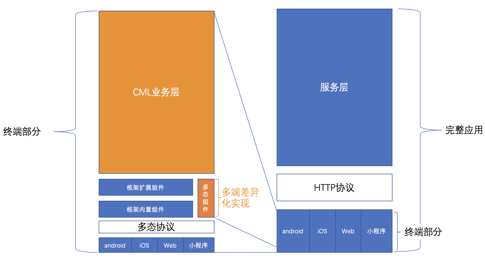

# Chamelon

## 基本介绍

* Chameleon/kəˈmiːlɪən/，简写CML，中文名卡梅龙；中文意思变色龙，意味着就像变色龙一样能适应不同环境的跨端整体解决方案。

* 开源时间：2019.01

* github地址：https://github.com/didi/chameleon

* 中文文档：https://cml.js.org/doc/api/api.html

## 兼容性

* H5端、微信小程序、APP端（Chameleon Playground App、Weex playground）

## 设计理念

* 通过定义统一的语言框架+统一多态协议，从多端（对应多个独立服务）业务中抽离出自成体系、连续性强、可维护强的“前端中台服务”。

## DSL

* 类Vue系，采用CML + CMSS + JS

## 实现原理

## 学习全景图

## 缺点

* 开源时间短，文档、代码不够完善
* 小程序兼容性力度不够，支付宝、百度、头条小程序暂不兼容