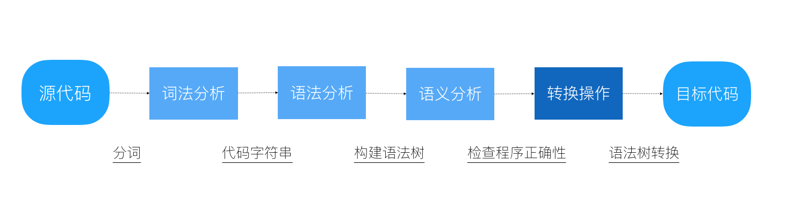

<!--
 * @Description: 文件描述
 * @Author: cuiyibao001
 * @Date: 2019-05-28 10:24:11
 * @LastEditTime: 2019-05-30 19:10:54
 * @LastEditors: cuiyibao001
 -->
# Taro

## 基本介绍

* Taro 是一套遵循 React 语法规范的 多端开发 解决方案

## 框架特点

## 兼容性

* H5、微信小程序、支付宝小程序、百度小程序、头条小程序、React Native

## DSL

* 类react语法，采用.js、.ts

## 设计思想

## taro产出H5页面兼容现有的SSR框架

### 兼容方法：

* h5打包产出对应单文件的js和css
* h5打包嵌入组件