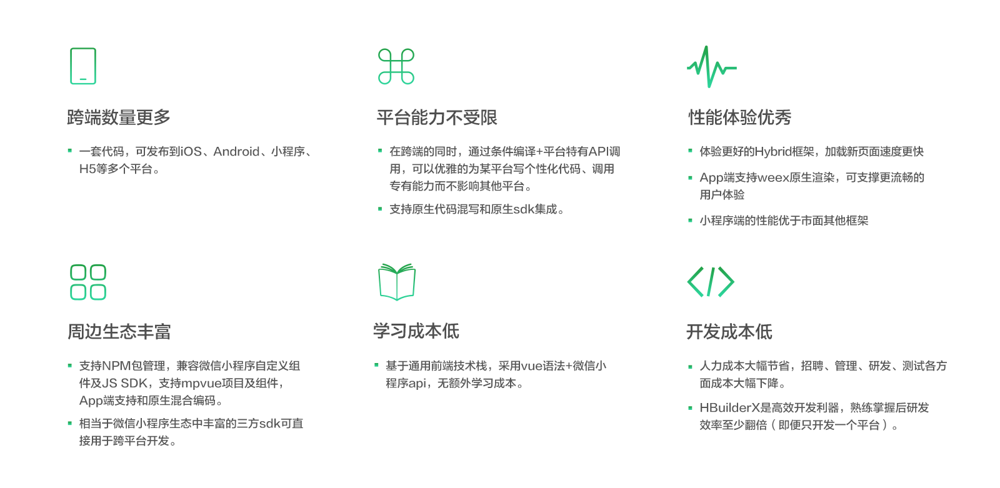

# Uni-app

## 基本介绍

* uni-app 是一个使用 Vue.js 开发跨平台应用的前端框架。

* github地址：https://github.com/dcloudio/uni-app

* 中文文档：https://uniapp.dcloud.io/

## 框架特点

## 开发规范

* 页面文件遵循 Vue 单文件组件 (SFC) 规范
* 组件标签靠近小程序规范，详见uni-app 组件规范
* 接口能力（JS API）靠近微信小程序规范，但需将前缀 wx 替换为 uni，详见uni-app接口规范
* 数据绑定及事件处理同 Vue.js 规范，同时补充了App及页面的生命周期
* 为兼容多端运行，建议使用flex布局进行开发

## DSL

* vue语法，采用.vue

## 生命周期

### 应用生命周期

|函数名|说明|
|---|---
|onLaunch|当uni-app 初始化完成时触发（全局只触发一次）
|onShow|当 uni-app 启动，或从后台进入前台显示
|onHide|当 uni-app 从前台进入后台
|onUniNViewMessage|对 nvue 页面发送的数据进行监听

## 缺点

* 依赖开发工具HBuilderX
* H5响应式兼容性问题明显