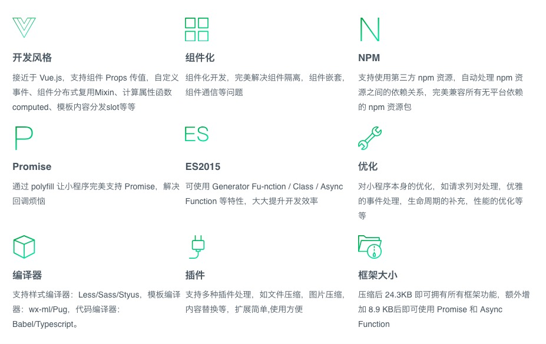

# Wepy

## 基本介绍

* WePY (发音: /'wepi/)是一款让小程序支持组件化开发的框架，通过预编译的手段让开发者可以选择自己喜欢的开发风格去开发小程序。框架的细节优化，Promise，Async Functions的引入都是为了能让开发小程序项目变得更加简单，高效

* github地址：https://github.com/Tencent/wepy

* 中文文档：https://tencent.github.io/wepy/index.html

## 框架特点

## DSL

* 类vue语法，采用.wpy

## 现有问题

* 静态组件编译：WePY 采用了静态组件编译这套方案，在编译组件时，直接将组件进行静态替换，导致动态 repeat 时会出现比较严重的 BUG。

* 语法解析：xml 的解析用了一个存在问题的库，导致 xml 解析时经常出错。js 的解析设计之初没有考虑用语法树解析，而是使用正则进行解析。因为目前仅涉及解析和语法注入，实现起来都比较简单，所以没有考虑用 AST 语法树进行解析，导致用户没有按照规范写的一些代码在解析时会出现错误。

* 数据绑定性能优化：数据绑定时做了一些优化和处理。但这些优化和处理是通过脏数据进行的，帮助用户减少 setDate 的次数。还是有可以优化的空间。

* 错误处理机制：目前 WePY 的错误处理还比较简单，没有一个通用的错误处理机制。用户在使用和编译时的报错很难追溯和定位。

* 测试用例覆盖度：WePY 目前只有核心库被测试用例覆盖。CLI 部分很复杂没有做测试用例覆盖。这导致目前大部分问题都和 CLI 相关。